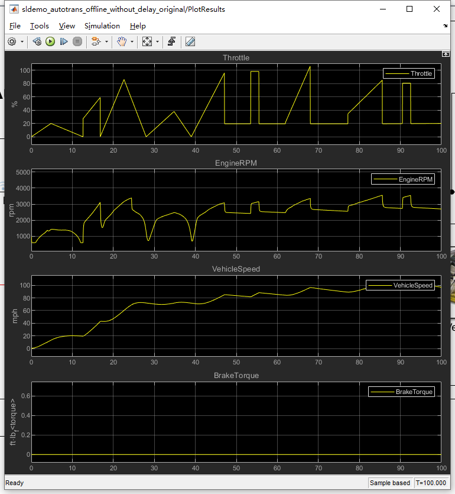

# AutoEncoder

## Introduction

This is a quick implementation based on Tensorflow2.x for auto-encoder-based signals anomaly detection.

The signals are artificially generated through Matlab Simulink. Only the Vehicle speed signals are used in this work.
[Link to Matlab model](https://ww2.mathworks.cn/help/simulink/slref/modeling-an-automatic-transmission-controller.html;jsessionid=4834aa15a9bb5f0bdd260aa8a990?lang=en)

## Quickstart

## Generate dataset

## Train

## Test

##